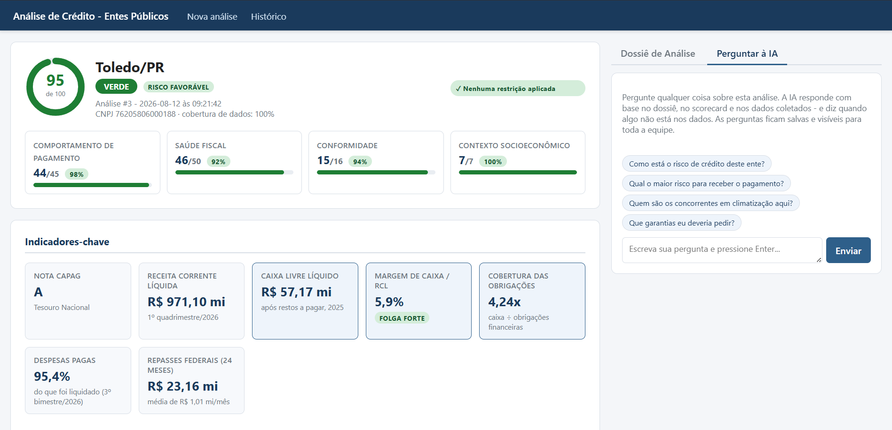

# Análise de Crédito - Entes Públicos

App web interno para o setor de licitações: digita o município, o sistema coleta dados
públicos oficiais, calcula um scorecard de crédito e gera um dossiê com recomendação
(verde/amarelo/vermelho) para decidir sobre pedidos grandes de entes públicos.



## Fontes consultadas automaticamente

| Fonte | O que traz |
|---|---|
| **SICONFI — registro de entes** | **Nome, UF, população e CNPJ oficial de cada um dos 5.570 municípios; resolve o CNPJ da prefeitura automaticamente** |
| **SICONFI — RGF Anexo 05 / RREO Anexo 07** | **Disponibilidade de caixa, obrigações financeiras, restos a pagar processados e não processados (inscritos, pagos, cancelados), despesas liquidadas x pagas — com evolução de 3 anos.** Tolera a modalidade **Simplificada/semestral** dos municípios pequenos (ver abaixo). |
| Tesouro Nacional — CAPAG | Nota oficial de capacidade de pagamento (A/B/C/D) e os 3 indicadores |
| SICONFI (RGF/RREO) | RCL, despesa com pessoal, dívida consolidada líquida (% da RCL), resultado orçamentário |
| Portal da Transparência — sanções | CEIS, CNEP e CEPIM do CNPJ do órgão |
| Portal da Transparência — repasses | Histórico mensal de recursos federais recebidos (24 meses), por órgão repassador |
| Portal da Transparência — convênios | Convênios com a União, valores e situação de adimplência |
| PNCP | Contratos dos últimos 24 meses, inclusive compras anteriores de climatização |
| BrasilAPI | Situação cadastral do CNPJ do órgão |
| IBGE | População, PIB municipal e per capita |

As três consultas ao Portal da Transparência exigem a chave gratuita; sem ela o sistema
funciona e marca essas seções como pendentes.

Serasa e CAUC não têm API pública — o formulário tem campos manuais para colar o
resultado dessas consultas, que entram no dossiê.

## Instalação (Windows)

```powershell
python -m venv .venv
.\.venv\Scripts\pip install -r requirements.txt
copy .env.example .env
# edite o .env e preencha as chaves (abaixo)
```

### Chaves necessárias

1. **`OPENAI_API_KEY`** — gera o texto do dossiê. Crie em https://platform.openai.com/api-keys
2. **`TRANSPARENCIA_API_KEY`** (opcional, recomendado) — consulta de sanções, repasses e
   convênios. Cadastro gratuito em https://portaldatransparencia.gov.br/api-de-dados/cadastrar-email
   (a chave chega por e-mail). Sem ela, o sistema funciona e marca essas seções como pendentes.

### Trocar de provedor de IA

A redação do dossiê é a única parte do sistema que usa IA, isolada em
[app/dossier.py](app/dossier.py). Para usar a Anthropic no lugar da OpenAI, basta no `.env`:

```
LLM_PROVIDER=anthropic
ANTHROPIC_API_KEY=...
```

O modelo padrão de cada provedor é configurável (`OPENAI_MODEL`, `ANTHROPIC_MODEL`).
Para ver quais modelos a sua chave OpenAI acessa: `.\.venv\Scripts\python listar_modelos.py`

## Uso

```powershell
.\.venv\Scripts\uvicorn app.main:app --host 127.0.0.1 --port 8000
```

Abra http://127.0.0.1:8000 — digite o município, selecione na lista e clique em **Gerar dossiê**.
A análise leva de 1 a 5 minutos.

> Para acessar de outras máquinas na rede local, troque `--host 127.0.0.1` por `--host 0.0.0.0` e
> **defina `APP_SENHA`** no `.env`. Sem senha o app não exige login — só aceitável em `127.0.0.1`;
> exposto na rede sem senha, qualquer máquina abriria os dossiês e dispararia análises (que
> consomem crédito de IA).

O **CNPJ da prefeitura é resolvido automaticamente** pelo registro do Tesouro, não digitado.
Isso não é só conveniência: um CNPJ digitado errado não falha, apenas traz dados de outra
entidade — e a análise cobre apenas municípios (não universidades ou autarquias).

A página do dossiê é dividida em duas colunas:

- **Esquerda** — a análise: anel do score, sub-scores por bloco, indicadores, medidores de limite
  legal, scorecard auditável e todas as evidências coletadas.
- **Direita** — duas abas: o **dossiê redigido pela IA** e um **chat** para perguntar sobre a
  análise. O chat responde com base no dossiê, no scorecard e nos dados coletados, e declara
  quando algo não está nos dados em vez de inventar.

O histórico do chat fica **salvo no banco**, não no navegador: sobrevive a um refresh, e as
perguntas de um analista ficam visíveis para o outro na mesma análise (com o nome de quem
perguntou, quando há login). O servidor mantém o histórico — o navegador envia apenas a
pergunta nova.

Outros detalhes:

- **Histórico**: todas as análises ficam salvas em `data/analises.db` (SQLite).
- **PDF**: no dossiê, use "Salvar em PDF / Imprimir" — a coluna do chat é omitida e o dossiê
  entra na sequência da análise.
- Caches locais em `data/`: base CAPAG (7 dias) e registro de municípios (30 dias).

## Como o score é calculado

Todo o cálculo é determinístico e auditável em [app/scoring.py](app/scoring.py) — a IA
não participa do cálculo, apenas redige o dossiê a partir dos números prontos:

| Dimensão | Peso |
|---|---|
| **Liquidez para fornecedores** (caixa ÷ obrigações financeiras) | 20 |
| **Pagamento de restos a pagar** (6 pago + 3 cancelado + 3 tendência) | 12 |
| **Execução de pagamento** (liquidado x pago) | 8 |
| **Tendência da liquidez** (3 anos, limitada pelo histórico) | 5 |
| Nota CAPAG | 30 |
| Despesa com pessoal (% RCL, limite LRF 54%) | 10 |
| Dívida consolidada líquida (% RCL, limite 120%) | 10 |
| Convênios federais (adimplência) | 8 |
| Sanções CEIS/CNEP/CEPIM | 8 |
| Porte populacional | 4 |
| PIB per capita | 3 |

O bloco de **comportamento de pagamento** (as quatro primeiras linhas, 45 pontos) pesa mais
que a CAPAG (30). A razão: a CAPAG responde *"este ente pode tomar dívida nova com garantia
da União?"*, enquanto a pergunta de um fornecedor é *"este ente paga a minha nota fiscal?"* —
relacionadas, mas não iguais. Os valores de caixa usam **recursos não vinculados**, o dinheiro
sem carimbo; o caixa vinculado a saúde, educação e FUNDEB infla o total mas não pode pagar
fornecedor comum.

O score (0–100) é normalizado pelas dimensões com dado disponível; fontes indisponíveis
viram "lacunas" declaradas e não penalizam o score. Regras adicionais: CAPAG D força
vermelho; CAPAG C, sanções ativas, caixa líquido negativo ou cobertura de dados < 50%
impedem o verde.

📖 A metodologia completa está em **[docs/METODOLOGIA.md](docs/METODOLOGIA.md)**: subdivisão da
classificação de risco, confiabilidade do score, restrições x ressalvas, critérios que exigem
trajetória (restos a pagar, liquidez, convênios) e o que é exibido mas não pontua (resultado
orçamentário, PNCP, repasses).

## Arquitetura

Em produção o app roda **serverless na AWS**, sem servidor ligado 24/7 — paga-se só pelo uso:

- **API Gateway (HTTP API)** — porta de entrada pública; encaminha as requisições ao Lambda.
- **AWS Lambda** — roda o app inteiro (FastAPI adaptado com [Mangum](https://mangum.io/)). O
  mesmo Lambda tem **dois papéis**: atende as requisições HTTP do navegador e, quando recebe um
  evento assíncrono, vira o *worker* que executa a análise pesada (~3 min) em segundo plano.
- **DynamoDB** — armazena análises, conversas do chat e o estado dos *jobs*.

A análise é **assíncrona**: `POST /analisar` cria um job e dispara o processamento em segundo
plano (o Lambda invoca a si mesmo); a página faz *polling* em `/status/{id}` e abre o dossiê
quando fica pronto. Assim cada requisição HTTP é curta (o API Gateway corta em 29s) e não há
espera travada de minutos.

O **armazenamento é escolhido automaticamente** em [app/config.py](app/config.py): SQLite em
disco no uso local; DynamoDB quando roda no Lambda (detectado por `AWS_LAMBDA_FUNCTION_NAME`).

## Deploy na AWS

Pré-requisitos: AWS CLI configurado; uma tabela **DynamoDB** (chaves `pk`/`sk`, modo on-demand);
uma função **Lambda** (python3.12) com um **API Gateway HTTP API** na frente; e as chaves do
`.env` cadastradas como variáveis de ambiente da função. O empacotamento usa
`requirements-lambda.txt` (sem uvicorn, com Mangum; `boto3` já vem no runtime do Lambda) e baixa
wheels Linux — roda a partir do Windows, sem Docker.

Para publicar uma nova versão do código:

```powershell
powershell -ExecutionPolicy Bypass -File deploy\deploy-lambda.ps1
```

Ajuste `AWS_PROFILE`, `AWS_REGION` e `FUNCTION_NAME` por variável de ambiente se os padrões não
baterem com a sua conta.

## Backup

- **Local (SQLite):** todo o estado (análises, dossiês e chats) está em `data/analises.db` —
  copiar esse arquivo é o backup completo. Os demais arquivos de `data/` são cache e se refazem.
- **Produção (DynamoDB):** habilite *Point-in-time recovery* na tabela para backup contínuo.

## Utilitários de conferência (sem servidor)

Testar os coletores contra um município real:

```powershell
.\.venv\Scripts\python teste_coletores.py 4202404 83108357000115
```

Ver o scorecard detalhado da última análise (ou de um id específico):

```powershell
.\.venv\Scripts\python ver_scorecard.py
```

Recalcular o score com o código atual sobre dados já coletados — útil para avaliar o efeito
de uma mudança de peso sem refazer a coleta:

```powershell
.\.venv\Scripts\python ver_scorecard.py --recalcular
```

Comparar municípios lado a lado, dimensão por dimensão. É a principal ferramenta de
validação: divergências de critério aparecem quando entes de perfis diferentes são postos
em coluna (sem argumentos, usa a última análise de cada município):

```powershell
.\.venv\Scripts\python comparar.py
```
